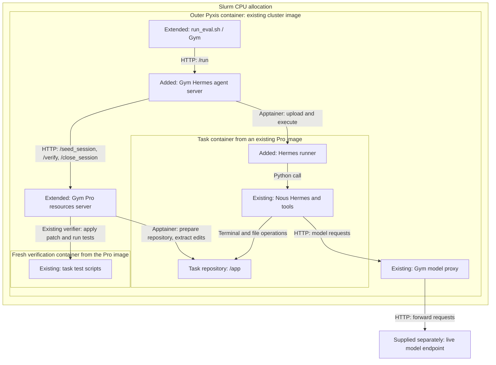

# Sandboxed Hermes for SWE-bench Pro

The target is SWE-bench Pro with [NousResearch/hermes-agent v2026.8.31](prepare_runtime.sh#L11)
(commit `29112bef099274229cadff79cdff7bf7b99c4b77`). The implementation follows
Gym's [OpenCode sandboxed agent](../opencode_sandboxed_agent/app.py#L886): Gym's Pro resources server prepares a task container, Hermes
works inside it, and that server grades the resulting file changes. The model
runs on a separate server.

The development branch is `jnolan/hermes-sandboxed-pro`, based on Gym
`86e2252f5`. James redirected this work from Verified to Pro after the team
discussion. Verified and multilingual evaluation are outside the current task.

## Components and where they run

**Gym already provided the SWE-bench Pro integration.** This work adds the
Hermes adapter and launch helpers, and extends two existing components so the
Pro server can hand its container to the Hermes agent server. The benchmark
preparation code, example data, verifier and model proxy are reused. Cluster
launch scripts and deployment settings live in the separate Slurm evaluations
repository, on the matching `jnolan/hermes-sandboxed-pro` branch.

The labels below compare our work with Gym `86e2252f5`: **Existing** means reused
without changes, **Extended** means an existing component we modified, and
**Added** means a new file or component from this session. They describe the
code and images; each run starts its own processes and task containers.

| Component | Status in this work | What it does and where it runs |
| --- | --- | --- |
| [Pro data preparation](../../benchmarks/swebench/pro/prepare.py#L153) and [five prepared examples](../../resources_servers/swebench_pro/data/example.jsonl#L1) | **Existing** | Input preparation and data files already in Gym. Their sources and paths are listed below. |
| [Gym Pro resources server](../../resources_servers/swebench_pro/app.py#L196) | **Extended** | Existing Python web server in the outer container. Prepares task containers and coordinates grading. We added optional terminal creation, connection details, explicit cleanup and local image selection. |
| [Pro verifier](../../resources_servers/swebench_pro/verification.py#L394) | **Existing** | Existing grading logic called by the Pro server. Runs the task's test commands in a fresh verification container. |
| [Gym Hermes agent server](app.py#L236) | **Added** | New Python web server in the outer container. Receives `/run`, requests a task container, starts Hermes inside it, then asks Pro to grade and clean up. |
| [Hermes runner](runner.py#L51) and [runtime preparation](prepare_runtime.sh#L27) | **Added** | The runner starts Hermes inside the task container. Runtime preparation builds its separate Python installation before a run. |
| [NousResearch Hermes v2026.8.31](prepare_runtime.sh#L11) | **Existing upstream software** | The pinned Hermes program, used without source changes. Runs inside the task container, calls the model and executes terminal/file tools. |
| [Gym model proxy](../../responses_api_models/openai_model/app.py#L93) | **Existing** | Python web server in the outer container. Forwards requests to the model endpoint; inference happens at that endpoint. |
| [Apptainer provider](../../nemo_gym/sandbox/providers/apptainer/provider.py#L281) | **Extended** | Existing Python library used by the outer Gym servers. Already created containers, ran commands and transferred files. We added reconnect. |
| [Standalone provider YAML](configs/apptainer.yaml#L2) and [cluster settings](https://gitlab-master.nvidia.com/interactive-agents/slurm-evaluations/-/blob/jnolan/hermes-sandboxed-pro/configs/swebench_pro.yaml#L6) | **Added** | The Hermes agent supplies its standalone Apptainer preset; Slurm evaluations supplies cluster mounts and execution settings. |
| [Image cache preparation](../../resources_servers/swebench_pro/image_cache.py#L45) | **Added** | Converts pinned registry images into SIFs and records their checksums. The Pro server checks the manifest before each container starts. |
| [Slurm launcher](https://gitlab-master.nvidia.com/interactive-agents/slurm-evaluations/-/blob/jnolan/hermes-sandboxed-pro/scripts/run_eval.sh) | **Extended** | Composes the separate agent and resources server through the existing Gym launch and evaluation commands. Reference-patch checks use Pro's existing client. |
| [Outer Pyxis container image](https://gitlab-master.nvidia.com/interactive-agents/slurm-evaluations/-/blob/jnolan/hermes-sandboxed-pro/scripts/run_eval.sh) | **Existing cluster infrastructure** | An already available image containing the Gym/Apptainer execution environment. The standard launcher takes its path from `CONTAINER_IMAGE`. |
| [Model endpoint](app.py#L187) | **Supplied separately** | For a live run, inference runs outside this CPU job. We have not created a model server; the CPU checks used an unreachable address. |

The [OpenCode sandboxed agent](../opencode_sandboxed_agent/app.py#L886) is also
existing Gym code. It was our reference for the agent/benchmark interface;
OpenCode itself is not started in the Hermes run.

### Where the benchmark data comes from

**The data used for our checks was already in the repository:**
[resources_servers/swebench_pro/data/example.jsonl](../../resources_servers/swebench_pro/data/example.jsonl#L1)
contains five prepared Pro tasks. The file is unchanged from the base commit.
Our CPU startup and reference-patch checks both used the
[Ansible task on line 4](../../resources_servers/swebench_pro/data/example.jsonl#L4).
The standard pipeline now prepares the pinned dataset through Gym, with optional limits or task selectors.

SWE-bench Pro consists of problem data, repository images and grading assets.
They have different upstream sources:

| Material | Original source | What Gym already provides |
| --- | --- | --- |
| Problems, reference patches and test expectations | Hugging Face dataset `ScaleAI/SWE-bench_Pro`, test split, at a [pinned revision](../../benchmarks/swebench/pro/prepare.py#L35). | The existing [dataset loader](../../benchmarks/swebench/pro/prepare.py#L162), plus the five prepared example rows checked into the repo. |
| Task-specific test scripts, output parsers and Dockerfile metadata | GitHub repository `scaleapi/SWE-bench_Pro-os`, at a [pinned commit](../../benchmarks/swebench/pro/prepare.py#L33). | Existing code [downloads the evaluator assets](../../benchmarks/swebench/pro/prepare.py#L54) and [embeds them in each prepared JSONL row](../../benchmarks/swebench/pro/prepare.py#L123). The checked-in examples already contain these assets. |
| Repository container images, including the task's dependencies | Docker Hub repository `jefzda/sweap-images`. | Existing preparation [resolves image digests](../../benchmarks/swebench/pro/prepare.py#L77), and the [Pro server selects the image](../../resources_servers/swebench_pro/app.py#L256) from each row's tag or digest. The image binaries are external to Git. |
| The prompt presented to the agent | Gym's [benchmarks/swebench/pro/prompt.txt](../../benchmarks/swebench/pro/prompt.txt#L1). | The existing [prompt renderer](../../benchmarks/swebench/pro/prepare.py#L44) inserts each task's problem, requirements and interface into that template. |

For the full public benchmark, Gym already has
[benchmarks/swebench/pro/prepare.py](../../benchmarks/swebench/pro/prepare.py#L153).
It is configured for [731 tasks](../../benchmarks/swebench/pro/prepare.py#L36) and
writes `benchmarks/swebench/data/swebench_pro_benchmark.jsonl`
([output path](../../benchmarks/swebench/pro/prepare.py#L39)). That generated file
is [gitignored](../../benchmarks/swebench/data/.gitignore#L1) and is not present
in this checkout; we have not prepared the full dataset in this session.

For our one selected example, the new launch helper pulled its existing image
by digest and converted it to an Apptainer SIF under
`pro-sifs/` in the cluster workspace. The added
[image-cache helper](../../resources_servers/swebench_pro/image_cache.py#L45) now names
SIFs by digest and records the original registry URI and local SIF checksum.
The Pro server rejects missing or mismatched manifests before using a local image.
The registry digest hashes the original image; the SIF checksum hashes the converted
file, so these are separate values. We reused the benchmark problem and image contents.

### Services and container boundaries

**The Pro resources server is Gym's web service for the benchmark.** The
[existing SWEBenchProResourcesServer class](../../resources_servers/swebench_pro/app.py#L196)
exposes task preparation and grading over HTTP. A request to `/seed_session`
is handled by its [seed_session() method](../../resources_servers/swebench_pro/app.py#L322),
which prepares a task container and returns its connection details. The dataset
itself remains a set of files consumed by these services.

The word **agent** refers to two pieces. The **added Gym Hermes agent server**
is the coordinating web service in [app.py](app.py#L136), outside the task
sandbox. The **existing Hermes program** is started by our added
[runner.py](runner.py#L94) inside that sandbox, where it executes the model/tool
loop. The language model runs at a separately configured HTTP endpoint.

Here, "outside the task sandbox" still means inside the outer container hosting
Gym. The labels in the diagram show what we reused, added or extended:

The [Slurm evaluations launch script](https://gitlab-master.nvidia.com/interactive-agents/slurm-evaluations/-/blob/jnolan/hermes-sandboxed-pro/scripts/run_eval.sh) starts the outer container
within a Slurm CPU allocation. Gym starts three separate HTTP services there: the Gym Hermes agent server, the Pro
resources server, and the model proxy. Each has its own port. The task and
verification containers use the same CPU allocation and are created as work
arrives. The
[Apptainer provider](../../nemo_gym/sandbox/providers/apptainer/provider.py#L281)
is a library used within the outer servers, rather than another HTTP service.

There are separate software installations. The outer processes use
Gym's per-service Python environments. The task container gets the
[portable Hermes Python installation mounted at /opt/hermes](https://gitlab-master.nvidia.com/interactive-agents/slurm-evaluations/-/blob/jnolan/hermes-sandboxed-pro/configs/swebench_pro.yaml#L63),
built by our new runtime preparation script using the existing
[portable-Python helper](prepare_runtime.sh#L27). The [task image](../../resources_servers/swebench_pro/app.py#L283)
supplies the repository's own languages, dependencies and test tools.

The [full prepared dataset row is sent between the outer Gym services](app.py#L239).
Only [model input and execution settings are uploaded to the task container](app.py#L174).
Reference patches and verifier scripts remain available to the Pro resources
server for grading; they are not included in the request sent to Hermes. After
Hermes finishes, the Pro resources server [extracts its file changes](../../resources_servers/swebench_pro/app.py#L402)
and [creates the fresh verification container](../../resources_servers/swebench_pro/app.py#L448).

## Follow one task

1. The Gym Hermes agent server's [run()](app.py#L236) sends an HTTP request to the Pro resources server's
   [/seed_session endpoint](../../resources_servers/swebench_pro/app.py#L322), passing the dataset row
   and session cookie. It requests [create_pty=false](app.py#L242) because Hermes executes
   ordinary commands and does not need an interactive terminal session.
2. The Pro resources server [prepares the task image](../../resources_servers/swebench_pro/app.py#L274) with the repository at `/app`, using its existing
   [environment setup](../../resources_servers/swebench_pro/app.py#L376). It [returns connection details](../../resources_servers/swebench_pro/app.py#L354) for that container.
3. The Gym Hermes agent server [attaches](app.py#L259) and [uploads the small Hermes runner, problem input and
   execution settings](app.py#L174). Reference patches and verifier scripts stay outside.
4. The runner [starts the pinned Hermes release](runner.py#L126). Its [tools operate in the task directory](runner.py#L67),
   while model requests go through [Gym's model proxy](../../responses_api_models/openai_model/app.py#L93) to the configured endpoint.
5. The Gym Hermes agent server [saves Hermes's conversation and execution result](app.py#L203) and [calls /verify over HTTP](app.py#L263).
   The Pro resources server [extracts the patch](../../resources_servers/swebench_pro/app.py#L402), [creates a fresh container](../../resources_servers/swebench_pro/app.py#L448),
   then [applies the patch, runs tests and returns its verdict](../../resources_servers/swebench_pro/verification.py#L394).
6. The Gym Hermes agent server [requests cleanup](app.py#L291), including when attachment or execution fails.
   An incomplete or failed Hermes run is excluded from scoring, with its original
   verifier reward retained separately for diagnosis. The scoring rules are below.

## Review order

| Read | What to look for |
| --- | --- |
| Agent: [run()](app.py#L236), then [_run_in_sandbox()](app.py#L156) | The complete task sequence and the data uploaded to the container. |
| Runner: [run()](runner.py#L51), then [main()](runner.py#L145) | Hermes configuration, tool working directory, model calls and result capture. |
| Pro: [seed_session()](../../resources_servers/swebench_pro/app.py#L322), [close_session()](../../resources_servers/swebench_pro/app.py#L223), then [verify()](../../resources_servers/swebench_pro/app.py#L420) | Optional terminal creation, container handoff and cleanup. Existing patch extraction and grading are reused. |
| Apptainer: [serialize_handle()](../../nemo_gym/sandbox/providers/apptainer/provider.py#L560), [connect()](../../nemo_gym/sandbox/providers/apptainer/provider.py#L579), then [create()](../../nemo_gym/sandbox/providers/apptainer/provider.py#L400) | Reconnecting from another Gym process. |
| [Runtime preparation](prepare_runtime.sh#L27), then [launch instructions](README.md#launch-with-pro) | Installing the exact Hermes release and composing the launch configuration. |
| [Agent handoff tests](tests/test_app.py#L172), [Pro handoff tests](../../resources_servers/swebench_pro/tests/test_app.py#L470), and [existing terminal behavior](../../resources_servers/swebench_pro/tests/test_app.py#L320) | Failure handling, cookies, cleanup and compatibility with existing Pro callers. |

## Work reused and adjustments required

**Hermes runner and packaging.** Hermes runs in a separate Python installation
because [its OpenAI SDK pin](https://github.com/NousResearch/hermes-agent/blob/29112bef099274229cadff79cdff7bf7b99c4b77/pyproject.toml#L40) differs from [Gym's](../../pyproject.toml#L94). This release needs its source
assets, so [runtime preparation retains the pinned source checkout](prepare_runtime.sh#L29). The runner
checks the [commit](runner.py#L54) and [import location](runner.py#L90). Python [starts outside the task repository
with -I](app.py#L198); terminal tools independently [use the repository working directory](runner.py#L71).
That prevents task files from overriding the runner's installed Python packages.

**The selected Hermes API.** The adapter targets this NousResearch release,
including its [constructor arguments](runner.py#L94) and explicit non-streaming requests for
Gym's proxy. The private [_disable_streaming flag](runner.py#L114) and [_build_api_kwargs()
wrapper](runner.py#L117) need review when changing Hermes versions. The [real model name](app.py#L35) and
[request timeouts](app.py#L42) are explicit settings.

**Pro container handoff.** Existing callers still [request a terminal by default](../../resources_servers/swebench_pro/app.py#L165).
[Hermes opts out](app.py#L242). Providers that support serialization [return a full descriptor](../../resources_servers/swebench_pro/app.py#L354);
the [legacy sandbox handle](../../resources_servers/swebench_pro/app.py#L168) remains available. A [cleanup endpoint](../../resources_servers/swebench_pro/app.py#L223) lets the agent
release Pro's session state even if it fails before grading. An optional [image
path template](../../resources_servers/swebench_pro/app.py#L256) supports locally cached Apptainer images. Pro's [patch extraction](../../resources_servers/swebench_pro/app.py#L402),
[verification scripts](../../resources_servers/swebench_pro/verification.py#L394), [environment repairs](../../resources_servers/swebench_pro/verification.py#L210) and [retry budgets](../../resources_servers/swebench_pro/app.py#L109) are reused.

**Apptainer: existing provider, with reconnect added.** Gym already had an
Apptainer provider on our base revision, including [container creation](../../nemo_gym/sandbox/providers/apptainer/provider.py#L400),
[command execution](../../nemo_gym/sandbox/providers/apptainer/provider.py#L610),
[file transfer](../../nemo_gym/sandbox/providers/apptainer/provider.py#L679) and
[cleanup](../../nemo_gym/sandbox/providers/apptainer/provider.py#L766). We reuse that implementation.

The agent-local [configs/apptainer.yaml](configs/apptainer.yaml#L2) is a new
standalone launch preset for the existing provider. Cluster mounts and settings
remain in Slurm evaluations.

The missing operation for this design was handing a running container from one
Gym process to another: the Pro resources server creates it, and the separate
Hermes agent server must then use it. I added [serialize_handle()](../../nemo_gym/sandbox/providers/apptainer/provider.py#L560)
to export the necessary connection details and [connect()](../../nemo_gym/sandbox/providers/apptainer/provider.py#L579)
to reconstruct a usable handle in the receiving process. Both processes
[must share a host, user and staging filesystem](../../nemo_gym/sandbox/providers/apptainer/provider.py#L582).
The OpenCode example's [launch instructions select OpenSandbox](../opencode_sandboxed_agent/README.md#L6),
which is a different sandbox provider; that example did not establish Apptainer reconnect support.

Container writes use Apptainer's existing `--writable-tmpfs` option. The earlier
disk-overlay extension was removed pending evidence that it is needed; the CPU
results below used that earlier configuration. The cluster-specific
[configuration](https://gitlab-master.nvidia.com/interactive-agents/slurm-evaluations/-/blob/jnolan/hermes-sandboxed-pro/configs/swebench_pro.yaml#L6) mounts the existing portable
Hermes runtime read-only into task containers; Slurm supplies CPU, memory and
wall-time limits through the [launch setup](https://gitlab-master.nvidia.com/interactive-agents/slurm-evaluations/-/blob/jnolan/hermes-sandboxed-pro/scripts/run_eval.sh).

## Review findings: scoring and benchmark compatibility

**Failed attempts have no benchmark score.** The [agent keeps `verifier_reward`](app.py#L272)
for diagnosis, but omits `reward` and `response` from failed attempt results and
sets Gym's existing `_ng_failure_class=agent_run_error` marker. The existing
[collector routes these attempts to its failures sidecar](../../nemo_gym/rollout_collection.py#L1472),
which keeps them out of its score. A completed agent with conclusive verification
still scores zero when its fix is wrong. An unfinished harness or inconclusive
verification is excluded. This is a completion rule, not a claim that every
excluded attempt was caused by infrastructure.

Slurm evaluations reports scored and excluded counts, coverage and accuracy.
If all attempts are excluded, accuracy is `null`.
A partial-coverage accuracy must not be reported as the full benchmark result.
The agent's [aggregate endpoint](app.py#L146) also filters failed rows for direct callers;
Gym's collector supplies only its scored rows to that endpoint and reports
missing-attempt coverage separately.

**Cross-benchmark swappability is unproven.** The agent and benchmark remain
separate programs, bound through configuration. However, this agent requires a
seed response containing a full serialized descriptor and a server that accepts
`create_pty=false`; it uses `cleanup_url_path` to release benchmark session state.
The [current Verified server returns only a bare handle](../../resources_servers/swebench/app.py#L318),
which cannot reconnect through Apptainer. We removed the misleading bare-handle
fallback and now report that missing capability explicitly.

The review correctly identifies reusable concepts in Pro's seed request/response.
The [shared base models are still empty](../../nemo_gym/base_resources_server.py#L128).
Moving fields there would describe a common interface, but each server must also
implement the handoff and cleanup. We have not changed Verified or demonstrated
a second benchmark; that migration remains shelved with the Verified work.

## Validation status

After the review fixes, CPU job `1918309` completed in 2m55s using 8 CPUs,
32 GiB and zero GPUs. It started the real Hermes runtime and Pro verifier with
an overlay under `/var/tmp` (a 14 TB filesystem on the node). The deliberately
unreachable model produced one excluded attempt, zero scored attempts and
`accuracy=null`; the smoke step exited 1 as expected. Agent and verifier reported
the same registry digest and SIF checksum. The job then applied the reference
patch in a fresh container: all 42 tests passed and `resolved=true`.
See the [review validation evidence](VALIDATION.md).

149 targeted tests pass across Hermes, Pro and Apptainer. These include the
existing [default terminal behavior](../../resources_servers/swebench_pro/tests/test_app.py#L320) and [new command execution handoff](../../resources_servers/swebench_pro/tests/test_app.py#L470), cleanup
on [failed preparation](../../resources_servers/swebench_pro/tests/test_app.py#L505) or [attachment](tests/test_app.py#L235), and [local image selection](../../resources_servers/swebench_pro/tests/test_app.py#L461). Ruff and
four-component configuration resolution pass.

CPU Slurm job `1916880`, using the [smoke driver](https://github.com/elisam0/Gym/blob/aeb168ca8d4b7b7c35f3714250b5164d94026f5d/responses_api_agents/hermes_sandboxed_agent/smoke.py#L123), completed in 2m20s using 8 CPUs, 32 GiB and zero GPUs.
The prepared Ansible Pro task started the pinned Hermes in its actual image,
with tool working directory `/app`, then reached the deliberately unreachable
model endpoint. The run returned through Pro verification and cleanup. Its empty
patch produced 38 passing tests and 4 failures. This historical artifact used the
old zero-reward failure behavior; subsequent runs use the exclusion rule above.

A separate [reference-patch control](https://github.com/elisam0/Gym/blob/aeb168ca8d4b7b7c35f3714250b5164d94026f5d/responses_api_agents/hermes_sandboxed_agent/check_verifier.py#L17), CPU job `1916905`, completed in 27 seconds.
The same Pro verifier applied the dataset's reference patch in a fresh container
and all 42 tests passed (`resolved=true`). This checks that the image and verifier
can grade a valid fix. It is not a Hermes-generated solution.

A live Hermes rollout remains unvalidated: successful inference, model-driven
tool activity and grading of the generated patch must still be inspected.
GPU use requires approval and a confirmed endpoint. Raw outputs are in the
[validation report](VALIDATION.md). Full logs remain in the development workspace.

The earlier Verified server changes, extra patch extraction test, generated
Verified dataset and startup evidence have been removed. The portable Hermes
runtime is retained for reuse. The read-only reference repositories are unchanged.

The initial interface supports [text input](runner.py#L28) and [terminal/file tools](configs/hermes_sandboxed_agent.yaml#L19). It records
[conversations](app.py#L71), [token usage](runner.py#L128) and [execution diagnostics](app.py#L213). Rich Hermes invocation and
compaction observation bundles are not implemented, and training token IDs are
not fabricated.
